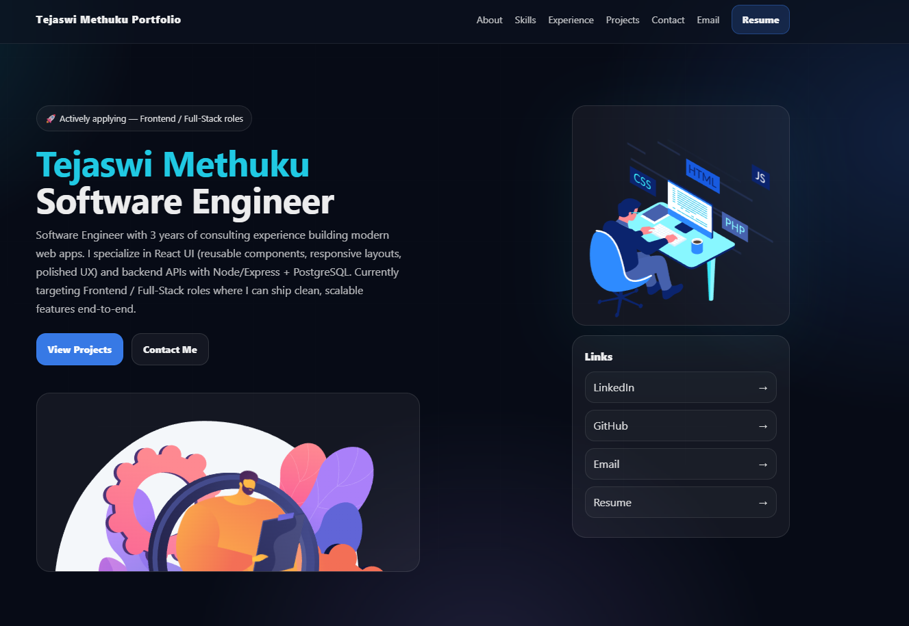
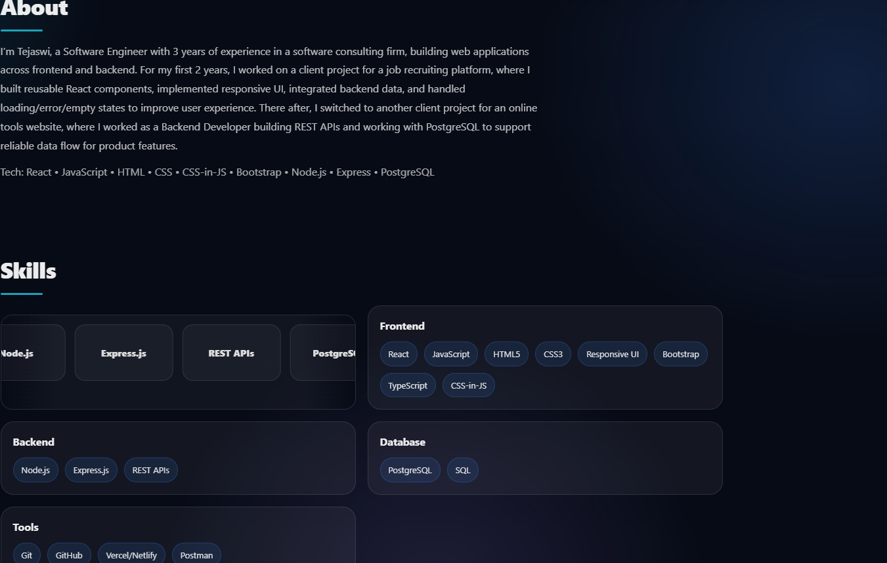

# Tejaswi Portfolio

Personal portfolio website showcasing my projects, skills, and experience.

## Live Demo

https://tejaswi-portfolio-react.vercel.app/

## Features

- Modern UI with animations and smooth section navigation
- Projects section with project details modal (features + tech stack + links)
- Skills section with marquee + highlighted skill cards
- Contact form powered by Formspree (messages delivered to email)
- Resume available as a downloaded PDF

## Tech Stack

- React (Vite)
- styled-components
- JavaScript, HTML, CSS

## Screenshots




## Run Locally

```bash
npm install
npm run dev
```
